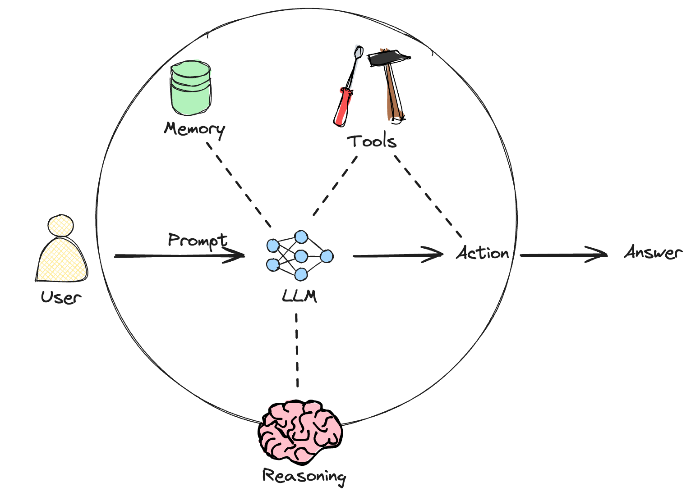

# Topics

-   What are AI agents ?
-   When to use AI agents?
-   Components of an AI agent
-   Agent Architectures
-   Building an AI agent
-   Adding memory to agents

## What are AI agents ?



An AI agent is a system that uses an LLM to reason through a problem, create a plan to solve the problem, and execute the plan with the help of a set of tools.

In multi-agent systems, two or more agents collaborate or orchestrate and delegate tasks to solve problems.

# When to use AI agents?

AI agents are best suited for complex, multi-step tasks that require integration of multiple capabilities, such as question-answering, analysis, task execution etc. to arrive at the final answer or outcome. An active area of research is to have AI agents learn from their past interactions to build personalized and adaptive experiences.

Here are some examples of tasks/questions that **DO NOT** require an AI agent:

> Who was the first president of the United States?

The information required to answer this question is very likely present in the parametric knowledge of most LLMs. Hence, this question can be answer using a simple prompt to an LLM.

> What is the reimbursement policy for meals for my company?

The information required to answer this question is most likely not present in the parametric knowledge of available LLMs. However, this question can easily be answered using Retrieval Augmented Generation (RAG) using a knowledge base consisting of your company's data.

Here are some use cases for AI agents:

> How has the trend in the average daily calorie intake among adults changed over the last decade in the United States, and what impact might this have on obesity rates? Additionally, can you provide a graphical representation of the trend in obesity rates over this period?

This question involves multiple sub-tasks such as data aggregation, visualization, and reasoning. Hence, this is a good use case for an AI agent.

# Components of AI agents

AI agents have three main components:

-   Planning and reasoning
-   memory
-   tools

## Planning and reasoning

AI agents use user prompts, self-prompting and feedback loops to break down complex tasks, reason through their execution plan and refine it as needed. Some common design patterns for planning and reasoning in AI agents are as follows:

### Chain of Thought (Cot) Prompting

In this approach, the LLM is prompted to generate a step-by-step explanation or reasoning process for a given task or problem.

Here is an example of a zero-shot CoT prompt:

> Given a question, write out in a step-by-step manner your reasoning for how you will solve the problem to be sure that your conclusion is correct. Avoid simply stating the correct answer at the outset.

### ReAct (Reason + Act)

In this approach, the LLM is prompted to generate reasoning traces and task-specific actions in an interleaved manner, allowing for greater synergy between the two: reasoning traces help the model induce, track, and update action plans, while actions allow it to interface with external sources or tools, to gather additional information.

Here is an example of a ReAct prompt:

```{Answer the following questions as best you can. You have access to the following tools:{tools}
##
Use the following format:
Question: the input question you must answer
Thought: you should always think about what to do
Action: the action to take, should be one of [{tool_names}]
Action Input: the input to the action
Observation: the result of the action
... (this Thought/Action/Action Input/Observation can repeat N times)
Thought: I now know the final answer
Final Answer: the final answer to the original input question
```

### Reflection

Reflection involves prompting an LLM to reflect on and critique past actions, sometimes incorporating additional external information such as tool observations. The generation-reflection loop is run several times before returning the final response to the user. Reflection trades a bit of extra compute for a shot at better output quality.

## Memory

The memory component allows AI agents to store and recall past conversations, enabling them to learn from these interactions.

There are two main types of memory for AI agents:

-   **Short-term memory**: Stores and retrieves information from a specific conversation.

-   **Long-term memory**: Stores, retrieves and updates information based on multiple conversations had over a period of time.

## Tools[​](https://mongodb-developer.github.io/ai-agents-lab/docs/ai-agents/components-of-agents#tools "Direct link to Tools")

Tools are interfaces for AI agents to interact with the external world and achieve their objectives. These can be APIs, vector databases, or even specialized machine learning models.

# Create Agent Tools

Create tools for the agent.

## Concepts

Here is a quick overview of concepts that you will come across in this section of the lab:

## Tool calling

Tool calling, interchangeably called function calling allows an LLM to use external tools such as APIs, databases, specialized machine learning models etc.

The easiest way to define tools in LangChain is using the `@tool` decorator. The decorator makes tools out of functions by using the function name as the tool name by default, and the function's docstring as the tool's description. The tool call inturn consists of a tool name, arguments, and an optional identifier.

An example of a tool in LangChain is as follows:

`{@tool("search-tool", return_direct=True)} def search(query: str) -> str:     """Look up things online."""     return "MongoDB"`

An example of a tool call is as follows:

```         
  "name": "search-tool",
  "args": {
    "query": "What is MongoDB?"
  },
  "id": "call_H5TttXb423JfoulF1qVfPN3m"
}
```

# 👐 Import data

The MongoDB learning assistant has two tools- a vector search tool to retrieve information to answer questions about MongoDB, and another tool to get the content of articles in our Developer Center for summarization.

Let's import the data required by these tools into two MongoDB collections. This is as simple as making a `GET` request to a serverless function that we have created for you.

#### References

https://mongodb-developer.github.io/ai-agents-lab/docs/intro