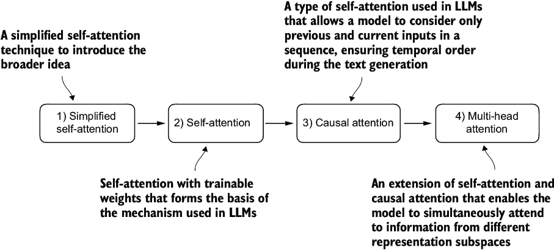

# Coding attention Mechanism

In this stage we focus on attention mechanism and self attention

### Problem with  Modeling Long Sequences

We can't simply transalate german to english or vice versa word by word in translation task. 
The translation process requires contextual understanding and grammatical alignment.

So the encoder - decoder architecture was introduced.

## Attention Mechanism

LLM architecture uses multihead attention mechanism but before that we will reach at multihead attention step by step in following sequence

1. Simplified Self-attention
2. Self attention  
3. Causal attention  
4. Multi-head attention

## Simplified Self-Attention

## Self-Attention with trainable weights 

This is the same attention mechanism used in transformers in GPT models. This is also called **scaled dot product attention**.   

- Here we adding trainable weight matrices which is crucial for  to produce “good” context vectors.

## Causal or Masked Attention  

Self-attention mechanism to consider only the tokens that appear prior to the current position when predicting the next token in a sequence.To achieve this in GPT-like LLMs, for each token processed, we mask out the future tokens, which come after the current token in the input text.

 For example, for the word “journey” in the second row, we only keep the attention weights for the words before (“Your”) and in the current position (“journey”).

## Multihead Attention 

Our final step will be to extend the previously implemented causal attention class over multiple heads. This is also called multi-head attention.
The term “multi-head” refers to dividing the attention mechanism into multiple “heads,” each operating independently. In this context, a single causal attention module can be considered single-head attention, where there is only one set of attention weights processing the input sequentially.  

The main idea behind multi-head attention is to run the attention mechanism multiple times (in parallel) with different, learned linear projections—the results of multiplying the input data (like the query, key, and value vectors in attention mechanisms) by a weight matrix. 

