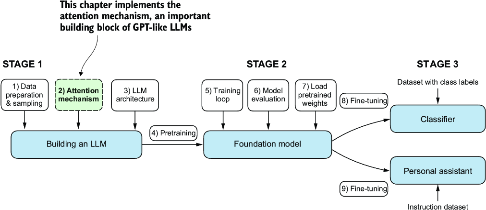
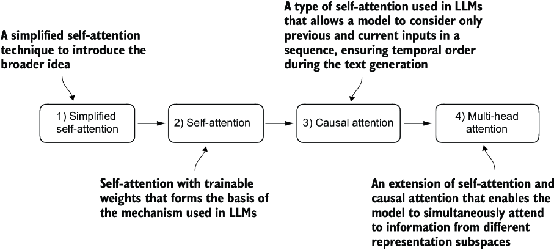

# Coding attention Mechanism

In this stage we focus on attention mechanism and self attention

### Problem with  Modeling Long Sequences

We can't simply transalate german to english or vice versa word by word in translation task. 
The translation process requires contextual understanding and grammatical alignment.

So the encoder - decoder architecture was introduced.

## Attention Mechanism

LLM architecture uses multihead attention mechanism but before that we will reach at multihead attention step by step in following sequence

1. Simplified Self-attention
2. Self attention  
3. Causal attention  
4. Multi-head attention

## Simplified Self-Attention

